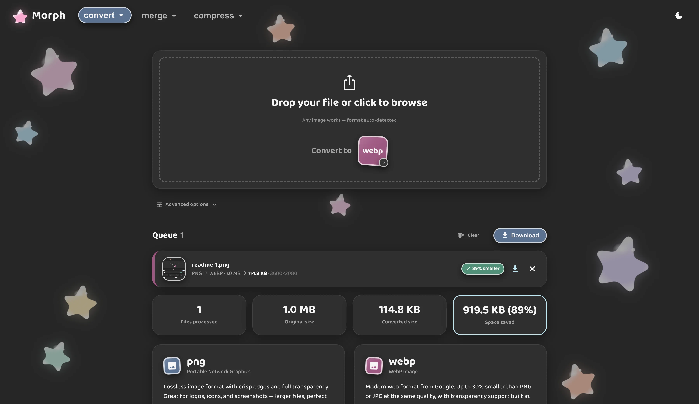
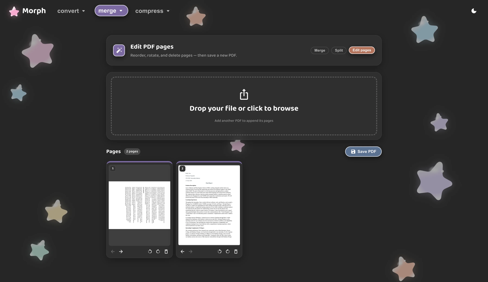
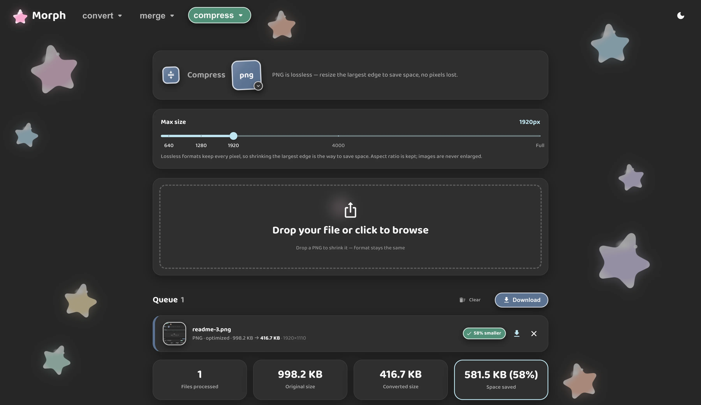
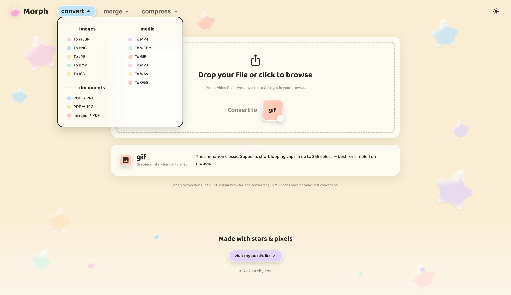
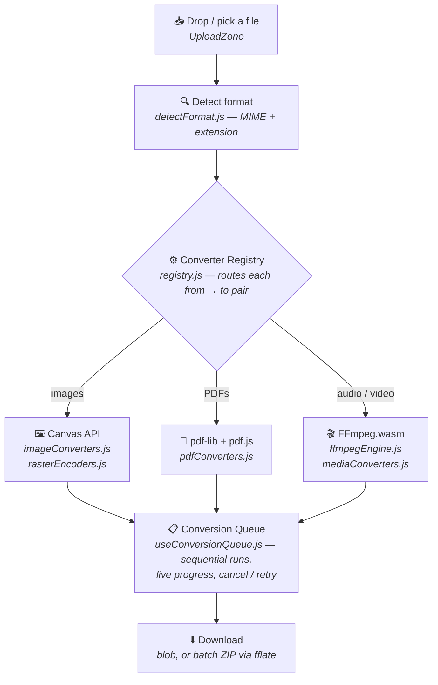

<div align="center">

# ✨ Morph · File Conversion, Beautifully

### Convert, compress, and merge your files right in the browser — images, PDFs, audio, and video. Fast, private, and free.

[](https://usemorph.netlify.app/)
[](https://react.dev/)
[](https://vite.dev/)
[](https://mui.com/)
[](#-license)

<br />

**[🌐 Try Morph](https://usemorph.netlify.app/) · [💼 LinkedIn](https://www.linkedin.com/in/kellytton/) · [🐙 GitHub](https://github.com/kellytton)**

</div>

---

## ✨ About

**Morph** is a browser-based file toolkit for converting, compressing, organizing images, PDFs, audio and video without ever uploading your files. Every operation runs locally using WebAssembly, FFmpeg.wasm, and browser APIs, keeping your data private while eliminating upload limits.

Beyond file conversion, Morph includes PDF editing tools, batch processing, live previews, compression analytics, and responsive interactions.

As someone who enjoys both software engineering and UI/UX design, I wanted Morph to feel as polished as it is practical. Every interaction was intentionally crafted to make everyday file management more enjoyable.

Thanks for stopping by. I hope Morph makes your file wrangling a little easier!

---

## 📸 Showcase

<div align="center">









</div>

---

## 🏗️ Architecture

Morph is a **single-page app with zero backend** — there's no server, database, or API. Every file operation happens client-side in a worker or on the main thread, so files never leave the browser.



**Key design decisions**

- **Data-driven UI** — the whole navigation and every conversion is described by config (`config/conversions.js`); adding a converter is a data change, not a component change.
- **Pluggable engine registry** — `converters/registry.js` maps each `from → to` pair to an engine, with runtime capability detection (`encodeSupport.js`) so unsupported formats are hidden rather than dead-ending.
- **Lazy, heavy assets** — the ~31 MB FFmpeg core loads only on the first media conversion, then is cached for the session.
- **URL-as-state routing** — no router library; the active tool and selection live in query params (`config/routing.js`), giving shareable links, working Back/Forward, and per-route SEO.
- **Cross-origin isolation** — `COOP`/`COEP` headers (set in `vite.config.js` + `netlify.toml`) enable `SharedArrayBuffer` for FFmpeg.

**Project structure**

```
src/
├── components/
│   ├── workspaces/   # per-tool UIs (convert, compress, merge, split, edit)
│   ├── queue/        # conversion queue, item rows, stats, lightbox
│   ├── conversion/   # format chips, pickers, quality/resize controls
│   ├── layout/       # header, nav, footer, app frame
│   ├── decor/        # animated stars, bursts, moons
│   └── common/       # sticker buttons, toggles
├── converters/       # the engines: image, pdf, media, + the registry
├── config/           # conversions (menu data) + URL routing
├── hooks/            # queue, FLIP reorder, localStorage
├── theme/            # MUI theme, sticker design tokens, palette
└── pages/            # HomePage router + 404
```

---

## 🌟 Features

- 🔒 **100% in-browser & private** — every conversion runs locally via WebAssembly + Canvas; your files never touch a server
- 🖼️ **Image conversion** — PNG, JPG, WebP, AVIF, BMP, ICO, with browser-capability detection (formats you can't encode are hidden, never a dead-end)
- 📄 **PDF toolkit** — PDF ↔ images, plus **merge, split, and a visual page editor** (reorder, rotate, delete) with live page thumbnails and a scissor-style split UI
- 🎬 **Audio & video** — transcode MP4, WebM, GIF, MP3, WAV, OGG via a lazy-loaded **FFmpeg.wasm** engine (cached after first use)
- 🗜️ **Smart compression** — quality control for lossy formats, resize control for lossless ones, with a "never make it bigger" guard
- ♿ **Accessible (WCAG 2.1 AA)** — semantic landmarks, skip link, live-region announcements, full keyboard support, and `prefers-reduced-motion` throughout
- 🔍 **SEO-ready** — per-route titles, Open Graph / Twitter cards, JSON-LD structured data, sitemap, and a branded 404
- 📱 **Fully responsive** — a sticky glass navbar, adaptive queue layout, and polish across desktop, tablet, and mobile
- 🎨 **Sticker-inspired design system** — hand-built pastel components, springy micro-interactions, and a starry animated backdrop

---

## 🛠️ Tech Stack

| Category         | Technologies                                                                                                                                                                                                                                                                                                |
| :--------------- | :---------------------------------------------------------------------------------------------------------------------------------------------------------------------------------------------------------------------------------------------------------------------------------------------------------- |
| **Framework**    |                                                                                                                        |
| **Build Tool**   |                                                                                                                                                                                                                                |
| **UI & Styling** |                                                                                                                           |
| **File Engines** |     |
| **Language**     |                                                                                                                                  |
| **Tooling**      |                                                                |

---

## 🚀 Running Locally

```bash
# Clone the repository
git clone https://github.com/kellytton/morph.git
cd morph

# Install dependencies
npm install

# Start the dev server
npm run dev
```

Then open **http://localhost:5173** in your browser.

> **Note:** Media (audio/video) conversion uses FFmpeg.wasm, which requires cross-origin isolation (`COOP`/`COEP` headers). These are set for local dev/preview in `vite.config.js` and for production in `netlify.toml`.

### Available Scripts

| Command           | Description                          |
| :---------------- | :----------------------------------- |
| `npm run dev`     | Start the local development server   |
| `npm run build`   | Build for production                 |
| `npm run preview` | Preview the production build locally |
| `npm run lint`    | Run ESLint across the project        |

---

## 📫 Get in Touch

<div align="center">

[](https://www.linkedin.com/in/kellytton/)
[](https://github.com/kellytton)
[](mailto:kthton@gmail.com)

</div>

---

## 📄 License

© 2026 Kelly Ton. All rights reserved.

<div align="center">

<br />

**Designed & built with 💕 by [Kelly Ton](https://github.com/kellytton)**

</div>
